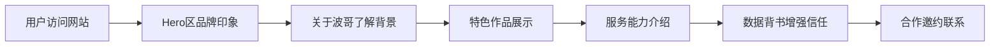

# 车站路波波（波哥）个人宣传网站 PRD

## 1. 产品概述
车站路波波（波哥）个人品牌宣传网站，展示武汉资深电台主持人、美食主持人的个人形象与专业服务。
- 面向武汉本地商家、粉丝及潜在合作伙伴，建立专业个人品牌形象
- 通过展示个人履历、特色作品、服务能力，吸引商业合作与粉丝关注

## 2. 核心功能

### 2.1 功能模块
单页网站，包含以下核心模块：
1. **首页Hero区**：个人形象展示、主标题、副标题、CTA按钮
2. **关于波哥**：个人履历介绍（电台主持、美食主持、媒体经验）
3. **特色作品展示**：精选作品展示（心灵鸡汤、武汉本地事、美食探店）
4. **服务能力**：为本地商家提供的服务介绍
5. **数据展示**：作品数量、粉丝影响力等数据
6. **联系方式/合作邀约**：合作联系方式
7. **页脚**：版权信息、技术支持链接

### 2.2 页面详情
| 页面名称 | 模块名称 | 功能描述 |
|-----------|-------------|---------------------|
| 首页 | Hero区 | 大幅背景图，展示波哥专业形象，主标题"车站路波波（波哥）"，副标题"武汉资深电台主持人 · 美食探店达人"，平滑滚动进入效果 |
| 首页 | 关于波哥 | 个人简介卡片，介绍52岁、湖北武汉、电台主持人、美食主持人背景，配个人照片 |
| 首页 | 特色作品 | 精选6个作品展示卡片，分类为：心灵鸡汤、武汉故事、美食探店，每个卡片带图片、标题、简介 |
| 首页 | 服务能力 | 3-4个服务卡片：商家探店推广、活动主持、品牌代言、内容创作 |
| 首页 | 数据展示 | 关键数据：1793+作品、粉丝量、获赞数、合作商家数等 |
| 首页 | 合作邀约 | 联系方式、合作咨询按钮 |
| 首页 | 页脚 | 版权信息、右下角固定技术支持按钮（链接到AI Tools Guide） |

## 3. 核心流程
用户访问网站 → 浏览Hero区第一印象 → 滚动查看个人介绍 → 了解作品风格 → 查看服务能力 → 联系合作

## 4. 用户界面设计

### 4.1 设计风格
- **主色调**：暖金色/橙色系（#D97706, #F59E0B）- 体现美食的温暖、媒体的活力、武汉的热情
- **辅助色**：深棕色/酒红色（#78350F, #991B1B）- 体现资深、稳重、有底蕴
- **中性色**：米白、暖灰 - 高端大气
- **按钮风格**：圆角（rounded-lg），金色渐变背景，悬停放大效果
- **字体**：标题使用有设计感的衬线/书法体（体现文化底蕴），正文使用现代无衬线体
- **布局风格**：全屏宽幅设计，卡片式布局，大量留白，高级感
- **图标**：使用Lucide图标，简洁线性风格

### 4.2 页面设计概览
| 页面名称 | 模块名称 | UI元素 |
|-----------|-------------|-------------|
| 首页 | Hero区 | 全屏渐变背景，大标题居中，金色装饰线条，向下滚动指示箭头，淡入动画 |
| 首页 | 关于波哥 | 左右分栏布局，左侧圆形/圆角个人照片，右侧文字介绍，金色引号装饰 |
| 首页 | 特色作品 | 3列网格卡片，悬停时卡片微微上浮，图片圆角，金色边框点缀 |
| 首页 | 服务能力 | 图标+标题+描述卡片，悬停效果，背景纹理 |
| 首页 | 数据展示 | 数字动画效果，大数字+小标签，横向排列 |
| 首页 | 合作邀约 | 金色渐变CTA区域，醒目的联系按钮 |
| 首页 | 技术支持 | 右下角固定悬浮按钮，与网站风格统一，链接到外部网站 |

### 4.3 响应式设计
- 桌面优先设计（1920px及以上）
- 平板适配（768px-1024px）：2列网格
- 手机适配（<768px）：单列布局，汉堡菜单，紧凑间距
- 触摸优化：按钮足够大（最小44px），悬停效果改为点击效果

### 4.4 动效设计
- 页面加载：元素依次淡入上浮（staggered animation）
- 滚动触发：元素进入视口时显示动画
- 悬停效果：卡片微上浮、按钮放大、图片轻微缩放
- 数字动画：数据区数字从0递增到目标值
- 导航：平滑滚动，导航栏滚动时背景变化
