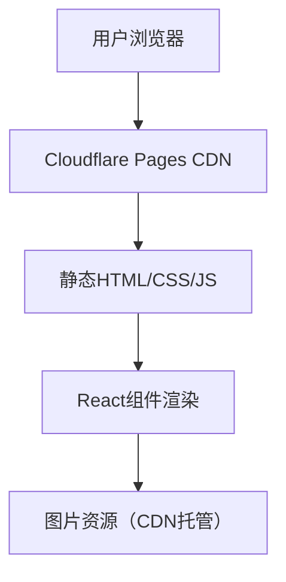

# 车站路波波（波哥）个人宣传网站 技术架构

## 1. 架构设计
纯前端单页应用，无后端服务，静态部署到Cloudflare Pages。



## 2. 技术说明
- **前端框架**：React 18 + TypeScript
- **构建工具**：Vite
- **样式方案**：Tailwind CSS 3
- **路由**：React Router DOM（单页锚点导航，无需复杂路由）
- **状态管理**：Zustand（轻量级状态管理）
- **图标库**：Lucide React
- **动画**：CSS动画 + Intersection Observer API（滚动触发）
- **部署**：GitHub + Cloudflare Pages

## 3. 路由定义
单页应用，使用锚点导航：
| 路由锚点 | 用途 |
|---------|------|
| #home | Hero首页区域 |
| #about | 关于波哥区域 |
| #works | 特色作品区域 |
| #services | 服务能力区域 |
| #contact | 合作联系区域 |

## 4. 项目结构
```
src/
├── components/
│   ├── Hero.tsx              # 首页Hero区
│   ├── About.tsx             # 关于波哥
│   ├── Works.tsx             # 特色作品
│   ├── Services.tsx          # 服务能力
│   ├── Stats.tsx             # 数据展示
│   ├── Contact.tsx           # 合作联系
│   ├── Footer.tsx            # 页脚
│   ├── Navbar.tsx            # 导航栏
│   ├── TechSupport.tsx       # 技术支持悬浮按钮
│   └── SectionWrapper.tsx    # 通用区块包装器
├── hooks/
│   └── useScrollAnimation.ts # 滚动动画Hook
├── data/
│   └── content.ts            # 网站内容数据
├── App.tsx                   # 主应用组件
├── main.tsx                  # 入口文件
└── index.css                 # 全局样式
```

## 5. 核心组件设计

### 5.1 数据模型
```typescript
interface Work {
  id: number;
  title: string;
  category: '心灵鸡汤' | '武汉故事' | '美食探店';
  description: string;
  image: string;
}

interface Service {
  id: number;
  icon: string;
  title: string;
  description: string;
}

interface Stat {
  number: number;
  label: string;
  suffix?: string;
}
```

### 5.2 关键技术点
1. **滚动动画**：使用Intersection Observer API检测元素进入视口，触发CSS动画
2. **数字递增动画**：使用requestAnimationFrame实现数字从0到目标值的平滑动画
3. **平滑滚动**：CSS scroll-behavior: smooth 实现锚点平滑滚动
4. **响应式图片**：使用loading="lazy"延迟加载，srcSet适配不同屏幕
5. **技术支持按钮**：固定定位在右下角，z-index高层级，外部链接打开新窗口
